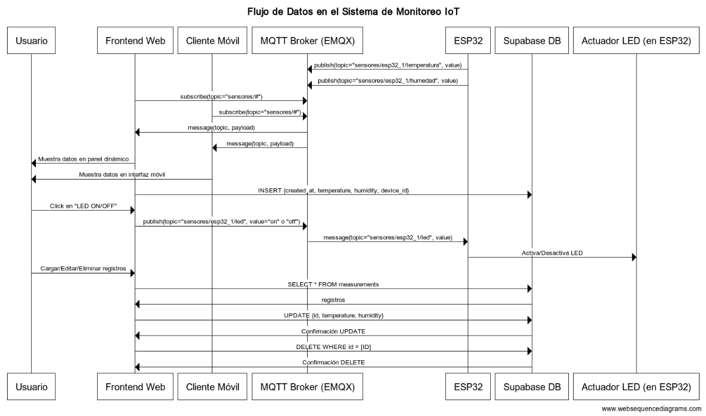

# Monitoreo IoT con ESP32, MQTT, Frontend Web, Supabase y React Native

Este proyecto integral demuestra una solución completa de monitoreo de dispositivos IoT (Internet de las Cosas) utilizando un microcontrolador ESP32, el protocolo MQTT para la comunicación en tiempo real, un frontend web interactivo para visualización y control, una base de datos en la nube (Supabase) para el almacenamiento persistente de datos, y un cliente móvil desarrollado con React Native para el monitoreo de datos.

## 🚀 Funcionalidades Principales

* **Monitoreo en Tiempo Real:** Visualización de temperatura y humedad de uno o múltiples dispositivos ESP32 en una interfaz web dinámica.
* **Control de Actuadores:** Capacidad para controlar un LED (como actuador de ejemplo) en el ESP32 desde la interfaz web.
* **Gestión de Múltiples Dispositivos:** El sistema está diseñado para reconocer y mostrar automáticamente los datos de cualquier ESP32 que publique en los tópicos MQTT configurados.
* **Persistencia de Datos:** Almacenamiento de lecturas de sensores (temperatura, humedad, ID del dispositivo y fecha/hora) en una base de datos PostgreSQL alojada en Supabase.
* **Operaciones CRUD en la Nube:** El frontend web permite:
    * **Consultar:** Cargar y visualizar todos los registros de la base de datos.
    * **Modificar:** Actualizar los valores de temperatura y humedad de un registro existente por su ID.
    * **Eliminar:** Borrar registros específicos de la base de datos directamente desde la tabla de visualización.

## ⚙️ Tecnologías Utilizadas

* **Microcontrolador:** ESP32
* **Firmware:** MicroPython
    * Librerías para DHT22, OLED (SSD1306), RTC (DS1307), SPI, SDCard, WiFi, y MQTT (`umqtt.simple`).
* **Comunicación:** MQTT (Message Queuing Telemetry Transport)
    * **Broker MQTT:** `broker.emqx.io` (público)
* **Frontend Web:**
    * HTML5 para la estructura (`index.html`)
    * CSS3 para el estilo (`style.css`)
    * JavaScript para la lógica interactiva (`script.js`)
    * Librería `mqtt.js` para la comunicación MQTT en el navegador.
    * Librería `@supabase/supabase-js` para interactuar con la base de datos Supabase.
* **Cliente Móvil:**
    * React Native
    * Librerías MQTT para React Native (ej., `mqtt` o `react-native-mqtt`)
* **Base de Datos:** Supabase (PostgreSQL en la nube)
    * Utilizado para almacenar los datos de los sensores de forma persistente.
* **Despliegue Web:** GitHub Pages (para alojar el frontend web estático).

## 🛠️ Configuración y Puesta en Marcha

### 1. Configuración del ESP32 (MicroPython)

1.  **Flashear MicroPython:** Asegúrate de que tu ESP32 tenga flasheado el firmware de MicroPython.
2.  **Cargar Librerías:** Copia los archivos `ssd1306.py`, `ds1307.py`, y `sdcard.py` (si usas SD) en la raíz de tu ESP32.
3.  **Modificar `main.py`:**
    * Abre `micropython files/main.py`.
    * **Configuración WiFi:** Actualiza `SSID` y `PASSWORD` con las credenciales de tu red Wi-Fi local.
    * **ID del Dispositivo:** Cambia `DEVICE_ID = "esp32_1"` a un identificador único para cada ESP32 que desees desplegar (ej., `"esp32_ambiente"`, `"esp32_oficina"`).
    * **RTC DS1307:** Si usas el módulo RTC, la configuración de fecha y hora se realiza al inicio.
    * **Carga el archivo `main.py`** a tu ESP32 (usando Thonny o similar).

4.  **Hardware (Opcional):**
    * Conecta un sensor DHT22 al GPIO 4.
    * Conecta una pantalla OLED SSD1306 vía I2C (SCL=GPIO22, SDA=GPIO21).
    * Un LED en el GPIO 5 (para control remoto).
    * Módulo RTC DS1307 (opcional, para timestamp precisos y guardar en SD).
    * Lector de tarjeta MicroSD (opcional, si activas la funcionalidad de registro local).

### 2. Configuración de Supabase

1.  **Crear Proyecto:** Inicia sesión en [Supabase](https://app.supabase.com/) y crea un nuevo proyecto.
2.  **Crear Tabla `measurements`:**
    * En tu proyecto de Supabase, ve a "Table Editor" y crea una nueva tabla llamada `measurements`.
    * Asegúrate de que tenga al menos las siguientes columnas (los tipos pueden variar ligeramente, pero estos son comunes):
        * `id`: `bigint`, Primary Key, `identity` (o `autoincrement`).
        * `created_at`: `timestamp with time zone`, default `now()`.
        * `temperature`: `float8` o `real`.
        * `humidity`: `float8` o `real`.
        * `device_id`: `text`.
3.  **Configurar Esquemas Expuestos:**
    * En "Project Settings" -> "API", busca "Schemas to expose in your API".
    * Asegúrate de que el esquema `public` esté incluido en la lista.
4.  **Configurar Políticas de Row Level Security (RLS):**
    * En "Database" -> "Tables", selecciona tu tabla `measurements` y ve a la pestaña "Policies".
    * **¡Importante!** Para que tu frontend pueda leer, modificar y eliminar datos con la clave `anon`, debes crear las siguientes políticas (o desactivar RLS en la tabla para pruebas rápidas, **no recomendado en producción**):
        * **Política `SELECT`:**
            * Nombre: `enable_select_for_anon_users`
            * Operación: `SELECT`
            * Roles de destino: `anon`
            * Expresión USING: `true`
        * **Política `UPDATE`:**
            * Nombre: `enable_update_for_anon_users`
            * Operación: `UPDATE`
            * Roles de destino: `anon`
            * Expresión USING: `true`
            * Expresión WITH CHECK: `true`
        * **Política `DELETE`:**
            * Nombre: `enable_delete_for_anon_users`
            * Operación: `DELETE`
            * Roles de destino: `anon`
            * Expresión USING: `true`
    * **Nota de seguridad:** Usar `true` en las expresiones de RLS permite acceso completo al rol `anon`. En una aplicación real, estas políticas deben ser mucho más restrictivas (ej., `auth.uid() = user_id` para permitir que los usuarios solo accedan a sus propios datos).

### 3. Configuración del Frontend Web (HTML, CSS, JavaScript)

1.  **`index.html`:**
    * Verifica que los scripts de `mqtt.js` y `@supabase/supabase-js` estén cargados.
    * Asegúrate de que tu `script.js` se cargue al final del `<body>` con `type="module"`.
    * **Elimina la línea `<base href="/mqtt-wildcards/" />`** si está presente y tu proyecto no se sirve desde una subcarpeta específica.
    * Asegúrate de que la estructura de los `div` para sensores y la gestión de Supabase coincidan con el HTML.
2.  **`script.js`:**
    * **Claves Supabase:** Copia la clave `anon` (pública) de tu proyecto de Supabase (en "Project Settings" -> "API" -> "Project API keys") y pégala en `SUPABASE_ANON` en tu `script.js`. Asegúrate de que `SUPABASE_URL` también sea la correcta para tu proyecto.
    * **Broker MQTT:** Asegúrate de que la URL del broker sea `wss://broker.emqx.io:8083/mqtt` para conexiones seguras desde GitHub Pages.
    * El resto del código ya está configurado para la detección dinámica de sensores, control de LED, inserción en Supabase, y las operaciones CRUD (leer, modificar, eliminar) desde la interfaz.
3.  **`style.css`:**
    * Este archivo contiene todos los estilos para la página, incluyendo el degradado de fondo, la disposición de los paneles de sensores, y los estilos para la tabla y formularios de Supabase.
    * Asegúrate de que el `body` tenga `min-height: 100vh;` para que el degradado cubra toda la altura de la página.
    * Los estilos de los botones LED (`button.led-button[data-command="on"]`, `button.led-button[data-command="off"]`) están configurados para coincidir con cómo el JS los crea.

## 🚀 Despliegue en GitHub Pages

1.  **Sube tus archivos:** Asegúrate de que todos los archivos ( `index.html`, `style.css`, `script.js`, y la carpeta `micropython files/` con `main.py` y librerías) estén en tu repositorio de GitHub.
2.  **Configura GitHub Pages:**
    * En tu repositorio de GitHub, ve a "Settings" -> "Pages".
    * Selecciona la rama (normalmente `main` o `master`) y la carpeta raíz (normalmente `/` o `/docs`) donde se encuentra tu `index.html`.
    * Guarda los cambios. GitHub Pages desplegará tu sitio, y te proporcionará una URL (ej. `https://tuusuario.github.io/turepositorio/`).

## ⚠️ Consejos de Depuración

* **Consola del Navegador (F12):** Siempre revisa la pestaña "Console" para ver errores de JavaScript y la pestaña "Network" para verificar si los recursos (CSS, JS) se cargan correctamente y si las conexiones WebSocket (para MQTT) o las solicitudes HTTP (para Supabase) tienen éxito o fallan.
* **Caché del Navegador:** Después de cada cambio y despliegue, fuerza una recarga completa del navegador (`Ctrl + Shift + R` o `Cmd + Shift + R`) para asegurar que estás viendo la última versión.
* **`DEVICE_ID` único:** Recuerda que cada ESP32 debe tener un `DEVICE_ID` único en su `main.py` para que el frontend los muestre como dispositivos separados.

¡Con esta configuración, tu también tendrás un sistema de monitoreo IoT completo y funcional!

## 📈 Diagrama de Secuencia del Flujo de Datos

Aquí se ilustra el flujo de datos y la interacción entre los diferentes componentes del sistema de monitoreo IoT.

